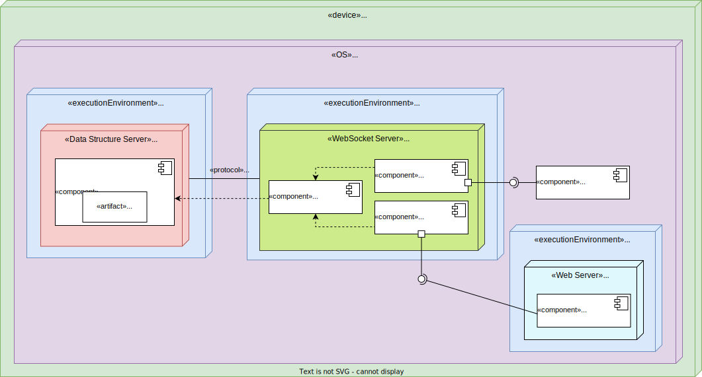
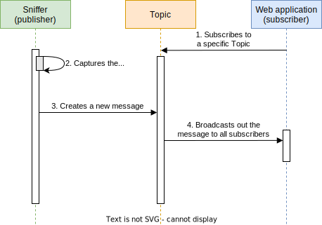

</img>
# Preferred Network List Sniffer - PNLS
[](https://opensource.org/licenses/MIT)


<p align="justify">Preferred Network List Sniffer (PNLS) is a Red Team Wi-Fi auditing tool with a simple web interface that is capable of intercepting SSIDs from device's preferred network lists (PNLs). This is achieved by sniffing out Probe Requests in the nearby vicinity which are then parsed for SSID and other information, and finally propagated to the web UI.</p>

> [!WARNING]
> All content in this project is intended for security research purpose only.

> [!NOTE]
> <p align="justify">I'm currently writting a tehnical paper which will thoroughly explain theory that makes this tool possible. It will be published by the end of this year.</p>

## Table of contents
- [Preferred Network List Sniffer - PNLS](#preferred-network-list-sniffer---pnls)
  - [Table of contents](#table-of-contents)
  - [How to build the PNLS](#how-to-build-the-pnls)
    - [Requirements - What you'll need](#requirements---what-youll-need)
    - [Prerequisites](#prerequisites)
  - [Setup](#setup)
    - [Using Docker](#using-docker)
    - [Using Prebuild Docker Image](#using-prebuild-docker-image)
    - [Without Docker](#without-docker)
  - [Architecture](#architecture)
    - [Why WebSockets?](#why-websockets)
    - [Pub-Sub Model](#pub-sub-model)
  - [References](#references)


## How to build the PNLS 

<p align="justify">Here are the things you will need in order to duplicate and deploy this project, including both the hardware and software components. Once you have your working environment ready, head over to <a href="https://github.com/AleksaMCode/Preferred-Network-List-Sniffer#setup">setup sections</a>.</p>

### Requirements - What you'll need

- Raspberry Pi (RPi)
- Suitable RPi power supply (see [the power supply documentation for details](https://www.raspberrypi.com/documentation/computers/getting-started.html#power-supply))
- Micro SD card (see [the SD card documentation for details](https://www.raspberrypi.com/documentation/computers/getting-started.html#sd-cards))
- USB Wi-Fi adapter (optional)
  - Used to achieve bigger range when capturing packets.
- HDMI cable (optional)
  - Used to display the web UI from the RPi instead of connecting to it remotely using your computer.

### Prerequisites

- Kali Linux OS
  - Needed in order to use monitoring mode and [aircrack-ng](https://github.com/aircrack-ng/aircrack-ng) tool. You can download Kali Linux ARM image [here](https://www.kali.org/get-kali/#kali-arm).
    - Alternatively, you could use another OS, but you will need to patch[^1] the kernel using the Nexmon or use a wireless adapter that supports monitoring mode. Here is a [link](https://elinux.org/RPi_USB_Wi-Fi_Adapters) for supported USB adapters by Raspberry Pi.
    - You will also have to install the *aircrack-ng* tool, as it only comes preinstalled on the Kali Linux.
- Start your network interface in a monitoring mode with: `airmon-ng start wlan0` [2].

## Setup

> [!IMPORTANT]
> Setup using Docker isn't available at the moment. It should be available soon.

### Using Docker

<p align="justify">Quickly setup a development instance, featuring hot-reloading on both the backend and the frontend:</p>

```bash
# First clone this repo.
git clone https://github.com/AleksaMCode/Preferred-Network-List-Sniffer.git
# Move to the project root folder.
cd Preferred-Network-List-Sniffer
# Bring up the backend:
docker compose up
# Move into the web folder.
cd web
# Install npm dependencies.
npm install --force
# Start hot-reloading web server:
npm run serve
# This will spawn a tab on `localhost:3000`.
```

### Using Prebuild Docker Image

<p align="justify">Download the prebuild image from the GitHub Container Registry and run it locally.</p>

```bash
docker run ghcr.io/aleksamcode/pnls-ghcr:latest
```

### Without Docker


## Architecture

<p align="justify">This project uses Event-Driven architecture (EDA) which is designed atop of message-driven architectures. While this project uses a centralized solution (everything is run from RPi),  due to loosely coupled components as a result of usage of EDA, it is possible to create a decentralized solution if needed. PNLS consists of event publisher (sniffer), event consumer (web application) and event channel. Here, the event channel is implemented as message-oriented middleware (MOM).
</p>

<p align="center">

<p align="center">
    <label>Fig. 1. PNLS system deployment diagram</label>
    </p>
</p>

### Why WebSockets?
<p align="justify">Through utilization of WebSocket communication protocol, we are able to facilitate full-duplex, two-way communication. While this project doesn't have the need for two-way communication, it does have a need for real-time interaction between the system components. This way, the sniffed data will be available to the end-user as soon as they are captured.
</p>

### Pub-Sub Model
<p align="justify">Project's MOM is realized through the Message Broker using Redis. In the publish-subscribe (pub-sub) model, <i>sniffer</i> is responsible for producing messages, while the web application (subscriber) registers for the specific Topic (Redis channel). When a sniffer sends a message to a Topic, it is distributed to all subscribed consumers, allowing for the asynchronous and scalable communication. PNLS uses lightweight messaging protocol <i>Redis Pub/Sub</i> for message broadcasting in order to propagate short-lived messages with low latency and large throughput [4][5]. In this way, overheads of encoding data structures in a form that can be written to a disk have been avoided and in doing this solution will have potential better performance [6]. Figure below displays the simplified system activity through the event-driven workflow.</p>

<p align="center">

<p align="center">
    <label>Fig. 2. PNLS Pub-Sub model sequence diagram</label>
    </p>
</p>

> [!NOTE]
> Implemented MOM does not provide a persistent storage or a message queue for data accumulation, which means messages will be lost if they are published to a Topic without subscribers.

## References

1. [Nexmon Git repository](https://github.com/seemoo-lab/nexmon)
2. [Aircrack-ng documentation](https://www.aircrack-ng.org/doku.php?id=airmon-ng)
3. [Enable Monitor Mode & Packet Injection on the Raspberry Pi](https://null-byte.wonderhowto.com/how-to/enable-monitor-mode-packet-injection-raspberry-pi-0189378/)
4. [Low-latency message queue & broker software](https://redis.com/solutions/use-cases/messaging/)
5. [Redis - Pub/Sub Defined](https://redis.com/glossary/pub-sub/)
6. [Stephen M. Rumble, Ankita Kejriwal, and John K. Ousterhout, “Log-Structured
Memory for DRAM-Based Storage,” at 12th USENIX Conference on File and Storage
Technologies (FAST)](https://www.usenix.org/system/files/conference/fast14/fast14-paper_rumble.pdf)


[^1]: Broadcom never officially supported monitor mode, which limited the usefulness of the wireless cards in Raspberry Pi devices [3]. The Nexmon project is a firmware patch for the Broadcom chips in use within Raspberry Pi devices [1]. This patch will allow you to use the monitoring mode on your RPi device.