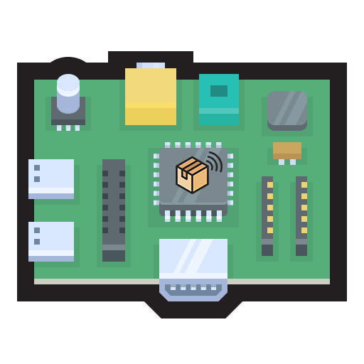

</img>
# Preferred Network List Sniffer - PNLS
[](https://opensource.org/licenses/MIT)


Preferred Network List Sniffer (PNLS) is a Red Team Wi-Fi auditing tool with a simple web interface that is capable of intercepting SSIDs[^1] from device's preferred network lists (PNLs). This is achieved by sniffing out [Probe Requests](#probe-request) in the nearby vicinity which are then parsed for SSID and other information, and finally propagated to the web UI. The primary motivation for this project was to look into 802.11 Probe Requests and the privacy risks associated the data they transmit.

<p align="center">

<p align="center">
    <label>Fig. 1. PNLS system overview</label>
    </p>
</p>

> [!WARNING]
> All content in this project is intended for security research purpose only.

> [!NOTE]
> - <p align="justify">I'm currently writting a tehnical paper which will thoroughly explain theory that makes this tool possible. It will be published by the end of this year.</p>
> - <p align="justify">To monitor the ongoing work on the PNLS, see <a href="https://github.com/users/AleksaMCode/projects/1">project's board</a>.</p>

## Table of contents
- [Preferred Network List Sniffer - PNLS](#preferred-network-list-sniffer---pnls)
  - [Table of contents](#table-of-contents)
  - [How to build the PNLS](#how-to-build-the-pnls)
    - [Requirements](#requirements)
    - [Prerequisites](#prerequisites)
  - [Setup](#setup)
    - [Using Docker](#using-docker)
    - [Using Prebuild Docker Image](#using-prebuild-docker-image)
    - [Without Docker](#without-docker)
  - [Probe Request](#probe-request)
  - [Architecture](#architecture)
    - [Why Asynchronous Server Gateway Interface?](#why-asynchronous-server-gateway-interface)
    - [Why WebSockets?](#why-websockets)
    - [Pub-Sub Model](#pub-sub-model)
  - [Acronyms](#acronyms)
  - [References](#references)

## How to build the PNLS 

<p align="justify">Here are the things you will need in order to duplicate and deploy this project, including both the hardware and software components. Once you have your working environment ready, head over to <a href="#setup">setup sections</a>.</p>

### Requirements

- Raspberry Pi (RPi)
- Suitable RPi power supply (see [the power supply documentation for details](https://www.raspberrypi.com/documentation/computers/getting-started.html#power-supply))
- Micro SD card (see [the SD card documentation for details](https://www.raspberrypi.com/documentation/computers/getting-started.html#sd-cards))
- USB Wi-Fi adapter (optional)
  - Used to achieve bigger range when capturing packets.
- HDMI cable (optional)
  - Used to display the web UI from the RPi instead of connecting to it remotely using your computer.

### Prerequisites

- Kali Linux OS
  - Needed in order to use monitoring mode and [aircrack-ng](https://github.com/aircrack-ng/aircrack-ng) tool. You can download Kali Linux ARM image from [here](https://www.kali.org/get-kali/#kali-arm).
    - Alternatively, you could use another OS, but you will need to patch[^2] the kernel using the [nexmon](https://github.com/seemoo-lab/nexmon)[^3] or use a wireless adapter that supports monitoring mode. Here is a [link](https://elinux.org/RPi_USB_Wi-Fi_Adapters) for supported USB adapters by Raspberry Pi.
    - You will also have to install the *aircrack-ng* tool, as it only comes preinstalled on the Kali Linux.
- Start your network interface in a monitoring mode with: `airmon-ng start wlan0` [2].

> [NOTE!]
> <p align="justify">The Kali image uses <a href="https://re4son-kernel.com/">Re4son</a>'s kernel, which includes the drivers for external Wi-Fi cards and the nexmon firmware for the built-in wireless card on the RPi 3 and 4 [3].</p>

<p align="center">

<p align="center">
    <label>Fig. 2. PNLS - RPi 4 with an external antena and a battery bank</label>
    </p>
</p>

## Setup

> [!IMPORTANT]
> Setup using Docker isn't available at the moment, but it should be added soon. For now you can use [setup without Docker](#without-docker).

### Using Docker

<p align="justify">Quickly setup a development instance, featuring hot-reloading on both the backend and the frontend:</p>

```bash
# First clone this repo.
git clone https://github.com/AleksaMCode/Preferred-Network-List-Sniffer.git
# Move to the project root folder.
cd Preferred-Network-List-Sniffer
# Bring up the backend:
docker compose up
# Move into the web folder.
cd web
# Install npm dependencies.
npm install
# Start hot-reloading web server:
npm start
# This will spawn a tab on `localhost:3000`.
```

### Using Prebuild Docker Image

<p align="justify">Download the prebuild image from the GitHub Container Registry and run it locally.</p>

```bash
docker run ghcr.io/aleksamcode/pnls-ghcr:latest
```

### Without Docker

- <p align="justify">Backend: to start the ASGI and Redis server and to run microservices see <a href="./sniffer/README.md">these instructions</a>.</p>
- <p align="justify">Frontend: to run the React server see <a href="./web/README.md"> these instructions</a>.</p>


Here is a screenshot when I ran everything "manually":

- Top Left: Redis server
- Top Right: ASGI server
- Bottom Left: sniffer service
- Bottom Right: React server

## Probe Request

<p align="justify">Probe Requests are management 802.11 frames which are used to connect devices to the previously associated wireless Access Points (AP). Whenever a device has enabled Wi-Fi, but it isn't connected to a network, it is periodically sending a burst of Probe Requests containing SSIDs from it's PNL. These frames are sent unencrypted, and anyone who is Radio Frequency (RF) monitoring can capture and read them. Probes are sent to the broadcast DA address (`ff:ff:ff:ff:ff:ff`). Once they are sent, the device starts the Probe Timer. At the end of the timer, the device processes the received answer. If the device hasn't received an answer, it will go to the next channel and repeat the process. There are two types of Probe Requests:</p>
<ul>
  <li><p align="justify"><i>Directed Probe Requests</i> - using specific SSID from device's PNL</p></li>
  <li><p align="justify"><i>Null Probe Requests</i> - using Wildcard SSID (empty SSID)</p></li>
  <ul>
    <li><p align="justify">Blank Requests are sent in order to get a response from all available APs that are in range.</p></li>
    <li><p align="justify">In addition to filtering 802.11 Probe Request frames from all the captured packets, Sniffer will also filter out the Wildcard SSIDs.</p></li>
  </ul>
</ul>


## Architecture

<p align="justify">This project uses Event-Driven architecture (EDA) which is designed atop of message-driven architectures. While this project uses a centralized solution (everything is run from RPi),  due to loosely coupled components as a result of usage of EDA, it is possible to create a decentralized solution if needed. PNLS consists of event publisher (sniffer), event consumer (web application) and event channel. Here, the event channel is implemented as Message-Oriented Middleware (MOM).</p>

<p align="center">

<p align="center">
    <label>Fig. 3. PNLS system deployment diagram</label>
    </p>
</p>

### Why Asynchronous Server Gateway Interface?

<p align="justify">Asynchronous Server Gateway Interface (ASGI) provides standardizes interface between async-capable Python web servers and services [4]. The ASGI was chosen due to the project's need for long-lived WebSocket connection in order to facilitate async communications between different clients. In addition, it also allows for utilization of the background coroutines during API calls. The PNLS uses <a href="https://github.com/encode/uvicorn">uvicorn</a> implementation for Python in order to use the ASGI web server.</p>

### Why WebSockets?
<p align="justify">Through utilization of WebSocket communication protocol, we are able to facilitate full-duplex, two-way communication. While this project doesn't have the need for two-way communication, it does have a need for real-time interaction between the system components. This way, the sniffed data will be available to the end-user as soon as they are captured.</p>

### Pub-Sub Model
<p align="justify">Project's MOM is realized through the Message Broker using Redis. In the publish-subscribe (pub-sub) model, <i>sniffer</i> is responsible for producing messages, while the web application (subscriber) registers for the specific Topic (Redis channel). When a sniffer sends a message to a Topic, it is distributed to all subscribed consumers, allowing for the asynchronous and scalable communication. PNLS uses lightweight messaging protocol <i>Redis Pub/Sub</i> for message broadcasting in order to propagate short-lived messages with low latency and large throughput [5][6]. In this way, overheads of encoding data structures in a form that can be written to a disk have been avoided and in doing this solution will have potential better performance [7]. Figure below displays the simplified system activity through the event-driven workflow.</p>

<p align="center">

<p align="center">
    <label>Fig. 4. PNLS Pub-Sub model sequence diagram</label>
    </p>
</p>

> [!NOTE]
> Implemented MOM does not provide a persistent storage or a message queue for data accumulation, which means messages will be lost if they are published to a Topic without subscribers.

## Acronyms
 <table>
  <tr>    <td>PNL</td>    <td>Preferred Network List</td>  </tr>
  <tr>  <td>PNLS</td>   <td>Preferred Network List Sniffer</td> </tr>
  <tr>    <td>SSID</td>    <td>Service Set Identifier</td>  </tr>
  <tr>    <td>UI</td>    <td>User Interface</td>  </tr>
  <tr>    <td>RPi</td>    <td>Raspberry Pi</td>  </tr>
  <tr>    <td>OS</td>    <td>Operating System</td>  </tr>
  <tr>    <td>AP</td>    <td>Access Points</td>  </tr>
  <tr>    <td>RF</td>    <td>Radio Frequency </td>  </tr>
  <tr>    <td>EDA</td>    <td>Event-Driven Architecture</td>  </tr>
  <tr>    <td>MOM</td>    <td>Message-Oriented Middleware</td>  </tr>
  <tr>    <td>ASGI</td>    <td>Asynchronous Server Gateway Interface</td>  </tr>
  <tr>    <td>pub-sub</td>    <td>publish-subscribe</td>  </tr>
</table>

## References

1. [Nexmon Git repository](https://github.com/seemoo-lab/nexmon)
2. [Aircrack-ng documentation](https://www.aircrack-ng.org/doku.php?id=airmon-ng)
3. [Kali On ARM documentation](https://www.kali.org/docs/arm/raspberry-pi-4/)
4. [ASGI Documentation](https://asgi.readthedocs.io/en/latest/introduction.html)
5. [Low-latency message queue & broker software](https://redis.com/solutions/use-cases/messaging/)
6. [Redis - Pub/Sub Defined](https://redis.com/glossary/pub-sub/)
7. [Stephen M. Rumble, Ankita Kejriwal, and John K. Ousterhout, “Log-Structured
Memory for DRAM-Based Storage,” at 12th USENIX Conference on File and Storage
Technologies (FAST)](https://www.usenix.org/system/files/conference/fast14/fast14-paper_rumble.pdf)
8. [Enable Monitor Mode & Packet Injection on the Raspberry Pi](https://null-byte.wonderhowto.com/how-to/enable-monitor-mode-packet-injection-raspberry-pi-0189378/)

[^1]: A Service Set Identifier (SSID) is an 802.11 ID used to name Wi-Fi network which consists of a maximum of 32 characters that can contain case-sensitive letters, numbers, and special characters no longer than 32 characters.
[^2]: Broadcom never officially supported monitor mode, which limited the usefulness of the wireless cards in Raspberry Pi devices [8]. The Nexmon project is a firmware patch for the Broadcom chips in use within RPi devices. [1]. This patch will allow you to use the monitoring mode on your RPi device.
[^3]: The C-based Firmware Patching Framework for Broadcom/Cypress WiFi Chips that enables Monitor Mode, Frame Injection and much more.